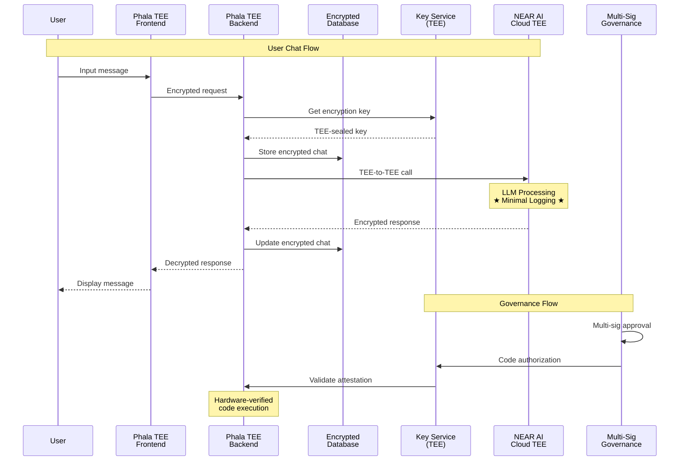

# TEE-Based Deployment Architecture

## Overview

The entire Open WebUI application stack runs within Phala Network's Trusted Execution Environment (TEE), providing hardware-level security for all components.

### TEE Deployment Model

```
┌──────────────────────────────────────────────────────────────────────────────────────────────────────────────────────────────────────┐
│                                                          Complete TEE Ecosystem                                                      │
├──────────────────────────────────────────────────────────────────────────────────────────────────────────────────────────────────────┤
│ ┌──────────────────────────────────────────────────────────┐          ┌────────────────────────────────────────────────────────────┐ │
│ │                       Private Chat                       │          │                    NEAR AI Cloud TEE                       │ │
│ ├──────────────────────────────────────────────────────────┤          ├────────────────────────────────────────────────────────────┤ │
│ │ ┌─────────────────────┐ ┌──────────────────────────────┐ │          │ ┌────────────────────────────────────────────────────────┐ │ │
│ │ │    Key Service      │ │      Private Chat App        │ │          │ │                 LLM Inference                          │ │ │
│ │ │    (Port 3001)      │ │                              │ │          │ │              ★ FULL PRIVACY ★                          │ │ │
│ │ │                     │ │                              │ │          │ │                                                        │ │ │
│ │ │  - Key Gen          │ │ ┌─────────────┐ ┌───────────┐│ │          │ │  - Model Processing                                    │ │ │
│ │ │  - Encryption       │ │ │  Frontend   │ │  Backend  ││ │          │ │  - Prompt Privacy                                      │ │ │
│ │ │  - TEE Sealed       │ │ │  (Svelte)   │ │ (FastAPI) ││ │          │ │  - Response Encryption                                 │ │ │
│ │ └─────────────────────┘ │ └─────────────┘ └───────────┘│ │          │ │  - Minimal System Logging                              │ │ │
│ │                         │                              │ │          │ └────────────────────────────────────────────────────────┘ │ │
│ │  Hardware               │ ┌──────────────────────────┐ │ │          │              Hardware                                      │ │
│ │  Attestation            │ │        Database          │ │ │          │              Attestation                                   │ │
│ │                         │ │     ★ENCRYPTED★          │ │ │          │                                                            │ │
│ │                         │ └──────────────────────────┘ │ │          │                                                            │ │
│ └────────────────────────────────────────────────────────┘ │          └────────────────────────────────────────────────────────────┘ │
├──────────────────────────────────────────────────────────────────────────────────────────────────────────────────────────────────────┤
│                                            Intel SGX / ARM TrustZone Hardware                                                        │
└──────────────────────────────────────────────────────────────────────────────────────────────────────────────────────────────────────┘
```

## System Flow



## NEAR AI Cloud TEE Integration

Uses **NEAR AI Cloud exclusively** within TEE environments for complete privacy:
- Minimal logging (no user data)
- TEE-to-TEE encrypted communication
- No training data collection

### Communication
- TEE-sealed key encryption
- Secure inference in NEAR AI Cloud TEE
- Hardware-verified attestation and signature exchange

## Database Security Within TEE

### Why the Database is Safe from Developers

Database runs entirely within TEE enclave with complete isolation:
- No direct database connections (psql, mysql, etc.)
- TEE-encrypted memory and storage
- Process isolation prevents debugging/inspection
- TEE-sealed keys inaccessible outside enclave

### Database Access Model

```
Traditional Model:
Developer -> SSH -> Server -> Database (VULNERABLE)

TEE Model:
Developer -> ❌ BLOCKED ❌ -> TEE Boundary -> Database (SECURE)
                          
Only Path:
Application Code (in TEE) -> Database (in TEE) ✅
```

## Decentralized Governance & Multi-Sig Authorization

### Decentralized Root of Trust (DeRoT)

Phala implements EVM-based key management with multi-signature authorization.

#### Governance Architecture

```
Ethereum Smart Contract (Multi-Sig)
        ↓
Phala DeRoT Network (P2P Key Management)
        ↓
TEE Instances (Private Chat Servers)
```

**Security Features**:
- Multi-party signature requirements
- Ethereum-recorded updates
- Governance revocation capability
- Hardware code attestation

### Key Management Lifecycle

```
Application Launch:
1. TEE requests keys from DeRoT
2. Validate TEE attestation
3. Check smart contract authorization
4. Derive application-specific keys
5. Seal keys to TEE + code

Key Rotation:
1. Governance triggers rotation
2. Generate new authorized keys
3. Preserve user data access
4. Revoke old keys
```

**Properties**: Hardware agnostic, migration support, forward secrecy

## Service Communication

### Internal Network Architecture

Services communicate through an isolated, hardware-encrypted TEE network:

```yaml
KEY_SERVICE_BASE_URL: http://key-service:3001
```

- TEE inter-service communication
- Hardware-encrypted networking
- No external interception

### External Access

```
User Browser -> HTTPS -> TEE Port 8080 -> Private Chat App
```

- Only port 8080 web interface exposed
- Internal services inaccessible
- Hardware-encrypted communication

## Deployment Security Model

### Threat Mitigation

**Protection**: Developer/cloud provider/infrastructure attacks, key theft, data exfiltration, government subpoenas, training data mining

**Governance**: Multi-sig authorization, on-chain transparency, community oversight

### Hardware Security Foundation

**Hardware Features**: Memory encryption, code attestation, data binding, side-channel mitigation

## Operational Security

### Update Management

**Update Process**: Multi-party review → Multi-sig approval → On-chain recording → Hardware validation → Key migration

**Auditability**: Blockchain governance records, cryptographic execution proofs, verifiable migration logs
