# TEE-Based Deployment Architecture

## Overview

This document describes an architecture where **the entire Open WebUI application stack runs within Phala Network's Trusted Execution Environment (TEE)**, providing **hardware-level security for every component** including frontend, backend, database, and key management services.

### TEE Deployment Model

```
┌──────────────────────────────────────────────────────────────────────────────────────────────────────────────────────────────────────┐
│                                                          Complete TEE Ecosystem                                                      │
├──────────────────────────────────────────────────────────────────────────────────────────────────────────────────────────────────────┤
│ ┌──────────────────────────────────────────────────────────┐          ┌────────────────────────────────────────────────────────────┐ │
│ │                       Private Chat                       │          │                    NEAR AI Cloud TEE                       │ │
│ ├──────────────────────────────────────────────────────────┤          ├────────────────────────────────────────────────────────────┤ │
│ │ ┌─────────────────────┐ ┌──────────────────────────────┐ │          │ ┌────────────────────────────────────────────────────────┐ │ │
│ │ │    Key Service      │ │      Private Chat App        │ │          │ │                 LLM Inference                          │ │ │
│ │ │    (Port 3001)      │ │                              │ │          │ │              ★ FULL PRIVACY ★                          │ │ │
│ │ │                     │ │                              │ │          │ │                                                        │ │ │
│ │ │  - Key Gen          │ │ ┌─────────────┐ ┌───────────┐│ │          │ │  - Model Processing                                    │ │ │
│ │ │  - Encryption       │ │ │  Frontend   │ │  Backend  ││ │          │ │  - Prompt Privacy                                      │ │ │
│ │ │  - TEE Sealed       │ │ │  (Svelte)   │ │ (FastAPI) ││ │          │ │  - Response Encryption                                 │ │ │
│ │ └─────────────────────┘ │ └─────────────┘ └───────────┘│ │          │ │  - Zero Data Retention                                 │ │ │
│ │                         │                              │ │          │ └────────────────────────────────────────────────────────┘ │ │
│ │  Hardware               │ ┌──────────────────────────┐ │ │          │              Hardware                                      │ │
│ │  Attestation            │ │        Database          │ │ │          │              Attestation                                   │ │
│ │                         │ │     ★ENCRYPTED★          │ │ │          │                                                            │ │
│ │                         │ └──────────────────────────┘ │ │          │                                                            │ │
│ └────────────────────────────────────────────────────────┘ │          └────────────────────────────────────────────────────────────┘ │
├──────────────────────────────────────────────────────────────────────────────────────────────────────────────────────────────────────┤
│                                            Intel SGX / ARM TrustZone Hardware                                                        │
└──────────────────────────────────────────────────────────────────────────────────────────────────────────────────────────────────────┘
```

## System Flow

```mermaid
graph TD
    A[User Input] --> B[Phala TEE Frontend]
    B --> C[User Data Encryption]
    C --> D[Phala TEE Backend]
    D --> E[TEE-to-TEE Call]
    E --> F[NEAR AI Cloud TEE]
    F --> G[LLM Processing<br/>★ No Logging ★]
    G --> H[Encrypted Response]
    H --> I[TEE-to-TEE Return]
    I --> J[Response Decryption]
    J --> K[User Display]
    
    L[Multi-Sig Contract] --> M[Code Authorization]
    M --> N[Phala DeRoT]
    N --> O[Key Management]
    O --> D
    
    P[Database<br/>★ Encrypted ★] --> D
    
    style F fill:#e1f5fe
    style G fill:#e8f5e8
    style P fill:#fff3e0
    style L fill:#fce4ec
```



## NEAR AI Cloud TEE Integration

**Critical Privacy Feature**: This system uses **NEAR AI Cloud exclusively**, running entirely within TEE environments, avoiding external LLM API privacy risks.

### Key Privacy Guarantees
- **Zero Data Retention**: Prompts and responses are never logged
- **TEE-to-TEE Communication**: Encrypted, hardware-verified communication
- **No Training Data**: User conversations cannot be used for model improvement
- **Impossible Subpoenas**: Conversation data remains inaccessible

### Security Architecture
- **Encrypted Transit**: All prompts encrypted
- **Secure Processing**: LLM inference within TEE hardware
- **Authenticated Responses**: Cryptographically signed AI responses
- **Tamper-Proof Communication**: Impossible to intercept or modify responses

### Request Flow
1. User inputs message in frontend (Phala TEE)
2. Message encrypted with TEE-sealed key
3. Encrypted request sent to NEAR AI Cloud TEE
4. Secure LLM inference
5. Encrypted response returned
6. Response decrypted locally
7. Response displayed to user

### Attestation Process
- Mutual TEE environment integrity verification
- Hardware signature exchange
- Approved code signature validation
- Complete cryptographic trust chain

## Database Security Within TEE

### Why the Database is Safe from Developers

**🔒 Complete Isolation**: The database runs **entirely within the TEE enclave**, making it fundamentally impossible for developers to access it through traditional means:

1. **No Direct Connection**: Developers cannot connect to the database using standard database clients (psql, mysql, etc.) because:
   - The database service only accepts connections from within the TEE
   - Network traffic is encrypted and authenticated at the TEE level
   - Database ports are not exposed to the host system

2. **Memory Protection**: 
   - All database memory is encrypted by the TEE hardware
   - Host OS cannot read TEE memory contents
   - Database files are sealed using TEE-specific encryption

3. **Process Isolation**:
   - Database processes run in the secure enclave
   - Host system administrators cannot inspect running processes
   - No ability to attach debuggers or memory dump tools

4. **Encrypted Storage**:
   - Database files are encrypted using TEE-sealed keys
   - Keys are only available within the TEE environment
   - Even with physical disk access, data remains encrypted

### Database Access Model

```
Traditional Model:
Developer -> SSH -> Server -> Database (VULNERABLE)

TEE Model:
Developer -> ❌ BLOCKED ❌ -> TEE Boundary -> Database (SECURE)
                          
Only Path:
Application Code (in TEE) -> Database (in TEE) ✅
```

## Decentralized Governance & Multi-Sig Authorization

### Decentralized Root of Trust (DeRoT)

Phala Network implements an **EVM-based Key Management System** with multi-signature authorization for TEE server updates.

#### Governance Architecture

```
Ethereum Smart Contract (Multi-Sig)
        ↓
Phala DeRoT Network (P2P Key Management)
        ↓
TEE Instances (Private Chat Servers)
```

#### Key Security Features

- **Code Deployment**: Multi-party signature requirements
- **Transparent Updates**: All changes recorded on Ethereum
- **Revocation Capability**: Governance can block malicious updates
- **Hardware Attestation**: TEE validates approved code

### Key Management Lifecycle

```
Application Launch:
1. TEE requests keys from DeRoT
2. Validate TEE attestation
3. Check smart contract authorization
4. Derive application-specific keys
5. Seal keys to TEE + code

Key Rotation:
1. Governance triggers rotation
2. Generate new authorized keys
3. Preserve user data access
4. Revoke old keys
```

#### Security Properties

- **Hardware Agnostic**: Compatible with various TEE technologies
- **Migration Friendly**: Supports cross-environment key transfer
- **Forward Secrecy**: Protects historical data during key rotation

## Service Communication

### Internal Network Architecture

Services communicate through an isolated, hardware-encrypted TEE network:

```yaml
KEY_SERVICE_BASE_URL: http://key-service:3001
```

**Security Properties**:
- Inter-service communication within TEE
- Hardware-level network encryption
- Secure DNS resolution
- No external network interception possible

### External Access

```
User Browser -> HTTPS -> TEE Port 8080 -> Private Chat App
```

**Access Control**:
- Web interface only exposed (port 8080)
- Internal services remain inaccessible
- TEE hardware encrypts all communication

## Deployment Security Model

### Threat Mitigation

**Comprehensive Protection Against**:
- Malicious Developer Interventions
- Cloud Provider Attacks
- Infrastructure Compromises
- Supply Chain Risks
- Key Theft Attempts
- Data Exfiltration
- LLM Provider Surveillance
- Government Subpoena Attempts
- Training Data Mining
- External API Interception

**Governance Guarantees**:
- Multi-Signature Authorization
- On-Chain Transparency
- Community Oversight
- Automated Security Validation

### Hardware Security Foundation

**Intel SGX / ARM TrustZone Features**:
- Hardware Memory Encryption
- Cryptographic Code Integrity Attestation
- Data Binding to Hardware/Software
- Side-Channel Attack Mitigation

## Operational Security

### Update Management

**Authorized Update Process**:
1. Multi-party Code Review
2. Multi-Signature Approval
3. On-Chain Authorization Recording
4. Hardware Code Validation
5. Secure Key Migration

### Monitoring and Compliance

**Auditability Features**:
- Ethereum Blockchain-Recorded Governance
- Cryptographic Execution Proofs
- Deterministic Key Derivation
- Verifiable Migration Logs

This architecture delivers a paradigm shift in application security through hardware-level protection, decentralized governance, and cryptographic verification.
